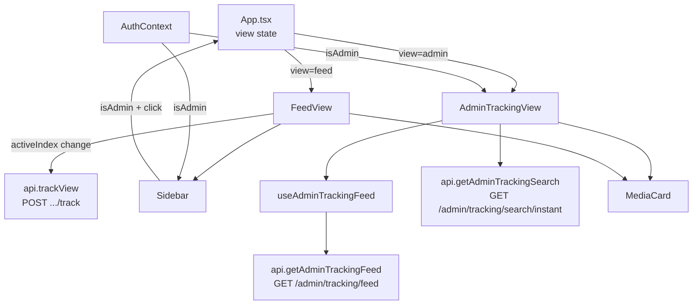

# Requirements

### Overview & Goals

Integrate the already-deployed backend tracking API into the React frontend:
1. **Fire-and-forget view tracking** — call `POST /api/providers/{provider}/media/{id}/track` once when a media item becomes the active (centered) item in the feed.
2. **Admin tracking feed** — a new admin-only UI that lets a `ROLE_ADMIN` user search for any user and browse their view history using the existing media-card component.

### Scope

**In Scope**
- Add `trackView` API function and call it from `FeedView` when `activeIndex` changes.
- Expose `roles` from the JWT in `AuthContext` / `useAuth`.
- Add admin-only "View Tracking" entry point in the `Sidebar`.
- New `AdminTrackingView` page component: user typeahead (instant search 3a), feed display via existing `MediaCard` (3b), order toggle, pagination.
- New API functions: `trackView`, `getAdminTrackingSearch`, `getAdminTrackingFeed`.
- App-level view routing: toggle between `FeedView` and `AdminTrackingView`.

**Out of Scope**
- `GET /api/admin/tracking/media/{id}` deep-link UI (low priority per spec).
- Retry logic for tracking calls.
- `q` / `flair` filtering on the admin tracking feed.

### User Stories

- As a **regular user**, my media views are silently recorded as I browse, with no visible change to the UI.
- As an **admin**, I can open a "View Tracking" panel from the sidebar, search for a user by email, and browse their full view history using the same media cards as the normal feed.

### Functional Requirements

1. `trackView` fires once per unique `activeIndex` change (not on re-renders). It is fire-and-forget — never blocks the UI, never shows an error.
2. The tracking request body includes only the non-empty fields from the current `query` (`q`, `source`, `flair`, `order`).
3. The admin nav entry is hidden for non-admin users (JWT `roles` claim contains `ROLE_ADMIN`).
4. The admin tracking feed uses the same `MediaCard` component as the normal feed.
5. Pagination uses `pagination.before` / `pagination.after` cursors from the feed response.
6. Order toggle supports `newest` / `oldest`.
7. User search is debounced typeahead using `GET /api/admin/tracking/search/instant?q=<text>`; the selected source's `slug` is passed verbatim as the `source` param to the tracking feed.

# Technical Design

### Current Implementation

- **HTTP client**: `src/lib/http.ts` — `apiFetch<T>` attaches `Authorization: Bearer <token>` automatically, handles 401/token-refresh, returns `undefined` for 204.
- **API layer**: `src/lib/api.ts` — thin wrappers over `apiFetch`. Pattern: one exported async function per endpoint.
- **Auth**: `src/context/AuthContext.tsx` — decodes JWT with `usernameFromJwt()`. Currently only exposes `username`; roles are in the JWT payload but not extracted.
- **Feed state**: `src/hooks/useFeedUrlState.ts` — owns `{ provider, query }` where `query` is `{ q, source, flair, order }`.
- **Feed data**: `src/hooks/useInfiniteFeed.ts` — fetches pages, exposes `items`, `activeIndex`, `setActiveIndex`.
- **Feed rendering**: `src/components/FeedView.tsx` — uses `IntersectionObserver` to update `activeIndex` as items scroll into view. This is the correct place to fire the track call.
- **Media card**: `src/components/MediaCard.tsx` — reused as-is for the admin tracking feed.
- **Sidebar**: `src/components/Sidebar.tsx` — account section at the bottom is the natural place for the admin nav entry.
- **App shell**: `src/App.tsx` — no router; renders `<FeedView>` directly inside `<AuthGuard>`.

### Key Decisions

1. **No router introduced** — the app has no React Router. The admin view is toggled via a boolean state in `App.tsx` (or a lifted `view` state), similar to how `sidebarOpen` works. The admin view renders in place of `FeedView` when active.
2. **Role extraction** — `AuthContext` already decodes the JWT; add `rolesFromJwt()` alongside `usernameFromJwt()` and expose `isAdmin: boolean` from the context value.
3. **Track call placement** — fire in `FeedView` inside a `useEffect` that depends on `activeIndex`. Use a `useRef` to track the last-tracked index so re-renders don't re-fire.
4. **Admin feed hook** — create `useAdminTrackingFeed` mirroring `useInfiniteFeed` but calling `getAdminTrackingFeed`. Keeps the admin page component thin.

### Proposed Changes

#### `src/lib/api.ts` — add three functions
```ts
// Fire-and-forget; caller ignores the return value
export async function trackView(
  provider: string,
  id: string,
  query: Pick<FeedQuery, 'q' | 'source' | 'flair' | 'order'>,
): Promise<void>

export async function getAdminTrackingSearch(
  q: string,
): Promise<InstantSearchResponse>

export async function getAdminTrackingFeed(
  source: string,
  opts?: { before?: string; after?: string; order?: string; limit?: number },
): Promise<FeedResponse>
```

#### `src/context/AuthContext.tsx` — expose `isAdmin`
- Add `rolesFromJwt(token)` helper (reads `payload.roles: string[]`).
- Add `isAdmin: boolean` to `AuthContextValue` and the context value object.

#### `src/components/FeedView.tsx` — fire track on active item change
```ts
const lastTrackedIndex = useRef<number>(-1);
useEffect(() => {
  if (activeIndex === lastTrackedIndex.current) return;
  const item = items[activeIndex];
  if (!item) return;
  lastTrackedIndex.current = activeIndex;
  trackView(item.provider, item.id, query).catch(() => {});
}, [activeIndex, items, query]);
```

#### `src/hooks/useAdminTrackingFeed.ts` — new hook
- Mirrors `useInfiniteFeed` but calls `getAdminTrackingFeed(source, { before, after, order })`.
- Exposes `{ items, isLoading, error, pagination, fetchPage }`.
- Resets when `source` or `order` changes.

#### `src/components/AdminTrackingView.tsx` — new component
- User search input with debounce → calls `getAdminTrackingSearch` → renders dropdown of `sources[]`.
- On source select: stores `selectedSlug`, loads feed via `useAdminTrackingFeed`.
- Renders items with `<MediaCard>` (same props as `FeedView`).
- Order toggle buttons (`newest` / `oldest`).
- Pagination: `before` / `after` cursor buttons from `pagination`.
- Back button to return to the normal feed.

#### `src/components/Sidebar.tsx` — admin nav entry
- In the account section, conditionally render a "View Tracking" button when `isAdmin` is true.
- Calls a new `onOpenAdminTracking` prop passed down from `FeedView` / `App`.

#### `src/App.tsx` — view toggle
- Add `const [view, setView] = useState<'feed' | 'admin'>('feed')`.
- Render `<AdminTrackingView onBack={() => setView('feed')} />` or `<FeedView onOpenAdminTracking={() => setView('admin')} />` based on `view`.

### File Structure

```
src/
  lib/
    api.ts                  ← add trackView, getAdminTrackingSearch, getAdminTrackingFeed
  context/
    AuthContext.tsx          ← add rolesFromJwt, isAdmin
  hooks/
    useAdminTrackingFeed.ts  ← NEW
  components/
    FeedView.tsx             ← add track useEffect, accept onOpenAdminTracking prop
    AdminTrackingView.tsx    ← NEW
    Sidebar.tsx              ← add admin nav entry (isAdmin gate + onOpenAdminTracking prop)
  App.tsx                   ← add view state, render AdminTrackingView
```

### Architecture Diagram



### Risks

- **Track fires on initial mount** — guard with `lastTrackedIndex.current = -1` and skip if `activeIndex === -1` or `items` is empty.
- **Re-render loop** — `query` object reference changes on every render; pass individual primitive fields to the `useEffect` dependency array instead of the whole object.
- **JWT roles field name** — the JWT payload field may be `roles` or `role`; verify against a real token or the backend's JWT config. The helper should handle both gracefully.

# Delivery Steps

### ✓ Step 1: Add tracking API functions and expose isAdmin from AuthContext
Three new API functions are added to api.ts and AuthContext exposes isAdmin.

- Add `trackView(provider, id, query)` to `src/lib/api.ts` — POST to `/api/providers/{provider}/media/{id}/track` with only non-empty query fields in the body; returns `Promise<void>`.
- Add `getAdminTrackingSearch(q)` to `src/lib/api.ts` — GET `/api/admin/tracking/search/instant?q=...`; returns `InstantSearchResponse`.
- Add `getAdminTrackingFeed(source, opts?)` to `src/lib/api.ts` — GET `/api/admin/tracking/feed` with `source`, optional `before`/`after`/`order`/`limit`; returns `FeedResponse` with items normalized via `normalizeMediaItem`.
- Add `rolesFromJwt(token)` helper in `src/context/AuthContext.tsx` (reads `payload.roles: string[]`).
- Add `isAdmin: boolean` to `AuthContextValue` interface and the context value object.

### ✓ Step 2: Fire view-tracking call from FeedView on active item change
FeedView silently calls trackView once each time a new item becomes active.

- Add a `lastTrackedIndex` ref (initialized to `-1`) in `src/components/FeedView.tsx`.
- Add a `useEffect` that depends on `activeIndex`, `items`, and the individual query fields (`query.q`, `query.source`, `query.flair`, `query.order`) — not the `query` object reference — to avoid spurious re-fires.
- Inside the effect: skip if `activeIndex === lastTrackedIndex.current` or `items[activeIndex]` is undefined; otherwise update the ref and call `trackView(item.provider, item.id, query).catch(() => {})`.
- Reset `lastTrackedIndex.current = -1` in the existing feed-reset effect (when provider/query scope changes) so the first item of a new feed is tracked.

### ✓ Step 3: Build useAdminTrackingFeed hook and AdminTrackingView component
A new hook and page component implement the full admin tracking UI.

- Create `src/hooks/useAdminTrackingFeed.ts`: accepts `{ source, order }`; calls `getAdminTrackingFeed`; exposes `{ items, isLoading, error, pagination }`; resets on `source`/`order` change; supports explicit `fetchPage({ before } | { after })` for pagination.
- Create `src/components/AdminTrackingView.tsx`:
  - Debounced text input calls `getAdminTrackingSearch` and renders a dropdown of `sources[]` (reuse the `SOURCE_TYPE_META` icon map from `Sidebar.tsx` for consistent styling).
  - On source select: stores `selectedSlug` (the `slug` field verbatim), feeds it to `useAdminTrackingFeed`.
  - Renders items with `<MediaCard>` (same props pattern as `FeedView`).
  - Order toggle buttons (`newest` / `oldest`).
  - Pagination prev/next buttons driven by `pagination.before` / `pagination.after`.
  - Back button that calls the `onBack` prop.
  - Entire component is gated: redirects/hides if `!isAdmin`.

### ✓ Step 4: Wire admin entry point into Sidebar and App-level view routing
The admin view is reachable from the sidebar and toggled at the App level.

- Add `onOpenAdminTracking?: () => void` prop to `Sidebar`; in the account section, render a "View Tracking" button (with a suitable Lucide icon, e.g. `Activity`) conditionally when `isAdmin && onOpenAdminTracking`.
- Add `onOpenAdminTracking` prop to `FeedView` and thread it through to `Sidebar`.
- In `src/App.tsx`: add `const [view, setView] = useState<'feed' | 'admin'>('feed')`; render `<AdminTrackingView onBack={() => setView('feed')} />` when `view === 'admin'`, otherwise `<FeedView onOpenAdminTracking={() => setView('admin')} />`.